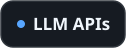

<picture>
  <source media="(prefers-color-scheme: dark)" srcset="assets/images/hero-dark.svg">
  <source media="(prefers-color-scheme: light)" srcset="assets/images/hero-light.svg">
  
</picture>

<br>

**Backend & automation developer.** I connect systems through APIs, automate the manual work between them and turn inconsistent data into something reliable — mostly with Python and Node.js. I use LLMs where they earn their place: structured extraction, scoring and agents inside automation flows. I've also automated security workflows on IBM QRadar SOAR, and cybersecurity is the area I'm growing into.

<sub>Based in Brasília, Brazil · Systems Analysis & Development (ADS) student</sub>

## Stack

| | |
|:--|:--|
| **Languages** | <picture><source media="(prefers-color-scheme: dark)" srcset="assets/icons/stack-languages-dark.svg"><source media="(prefers-color-scheme: light)" srcset="assets/icons/stack-languages-light.svg"></picture> |
| **Backend & APIs** | <picture><source media="(prefers-color-scheme: dark)" srcset="assets/icons/stack-backend-dark.svg"><source media="(prefers-color-scheme: light)" srcset="assets/icons/stack-backend-light.svg"></picture> |
| **Automation** | <picture><source media="(prefers-color-scheme: dark)" srcset="assets/icons/chip-playwright-dark.svg"><source media="(prefers-color-scheme: light)" srcset="assets/icons/chip-playwright-light.svg"></picture> <picture><source media="(prefers-color-scheme: dark)" srcset="assets/icons/chip-n8n-dark.svg"><source media="(prefers-color-scheme: light)" srcset="assets/icons/chip-n8n-light.svg"></picture> <picture><source media="(prefers-color-scheme: dark)" srcset="assets/icons/chip-power-automate-dark.svg"><source media="(prefers-color-scheme: light)" srcset="assets/icons/chip-power-automate-light.svg"></picture> <picture><source media="(prefers-color-scheme: dark)" srcset="assets/icons/chip-ui-vision-dark.svg"><source media="(prefers-color-scheme: light)" srcset="assets/icons/chip-ui-vision-light.svg"></picture> |
| **Data** | <picture><source media="(prefers-color-scheme: dark)" srcset="assets/icons/chip-pandas-dark.svg"><source media="(prefers-color-scheme: light)" srcset="assets/icons/chip-pandas-light.svg"></picture> <picture><source media="(prefers-color-scheme: dark)" srcset="assets/icons/chip-power-bi-dark.svg"><source media="(prefers-color-scheme: light)" srcset="assets/icons/chip-power-bi-light.svg"></picture> <picture><source media="(prefers-color-scheme: dark)" srcset="assets/icons/chip-dax-dark.svg"><source media="(prefers-color-scheme: light)" srcset="assets/icons/chip-dax-light.svg"></picture> <picture><source media="(prefers-color-scheme: dark)" srcset="assets/icons/chip-excel-dark.svg"><source media="(prefers-color-scheme: light)" srcset="assets/icons/chip-excel-light.svg"></picture> |
| **Applied AI** | <picture><source media="(prefers-color-scheme: dark)" srcset="assets/icons/chip-llm-apis-dark.svg"><source media="(prefers-color-scheme: light)" srcset="assets/icons/chip-llm-apis-light.svg"></picture> <picture><source media="(prefers-color-scheme: dark)" srcset="assets/icons/chip-structured-outputs-dark.svg"><source media="(prefers-color-scheme: light)" srcset="assets/icons/chip-structured-outputs-light.svg"></picture> <picture><source media="(prefers-color-scheme: dark)" srcset="assets/icons/chip-prompt-engineering-dark.svg"><source media="(prefers-color-scheme: light)" srcset="assets/icons/chip-prompt-engineering-light.svg"></picture> <picture><source media="(prefers-color-scheme: dark)" srcset="assets/icons/chip-ai-agents-dark.svg"><source media="(prefers-color-scheme: light)" srcset="assets/icons/chip-ai-agents-light.svg"></picture> |
| **Security** | <picture><source media="(prefers-color-scheme: dark)" srcset="assets/icons/chip-ibm-qradar-dark.svg"><source media="(prefers-color-scheme: light)" srcset="assets/icons/chip-ibm-qradar-light.svg"></picture> <picture><source media="(prefers-color-scheme: dark)" srcset="assets/icons/chip-qradar-soar-dark.svg"><source media="(prefers-color-scheme: light)" srcset="assets/icons/chip-qradar-soar-light.svg"></picture> <picture><source media="(prefers-color-scheme: dark)" srcset="assets/icons/chip-playbooks-rules-dark.svg"><source media="(prefers-color-scheme: light)" srcset="assets/icons/chip-playbooks-rules-light.svg"></picture> |
| **Frontend** | <picture><source media="(prefers-color-scheme: dark)" srcset="assets/icons/stack-frontend-dark.svg"><source media="(prefers-color-scheme: light)" srcset="assets/icons/stack-frontend-light.svg"></picture> |
| **Tools** | <picture><source media="(prefers-color-scheme: dark)" srcset="assets/icons/stack-tools-dark.svg"><source media="(prefers-color-scheme: light)" srcset="assets/icons/stack-tools-light.svg"></picture> |

<details>
<summary><b>How I use it</b></summary>
<br>

- **Python** — automation scripts, data extraction and cleaning, API clients, security automations in SOAR playbooks, and the core of my job-matching pipeline.
- **Node.js · TypeScript** — web backends and API aggregation; Next.js route handlers that keep API keys server-side.
- **PHP · Laravel** — REST APIs with request validation, resources, migrations and tests.
- **Playwright · n8n** — browser automation for JavaScript-rendered sites; orchestration of scheduled pipelines.
- **Power Automate · UI Vision** — RPA for business processes, mapped first, with exception handling and notifications.
- **pandas · Power BI · DAX · Excel** — cleaning and standardizing data, modeling relationships, building indicators and dashboards.
- **LLMs** — structured outputs for extraction and scoring, prompt and context engineering, AI agents inside automation workflows.
- **IBM QRadar · QRadar SOAR** — Python automations, rules and playbook nodes, validated through iterative testing.
- **Postman** — validating API contracts and debugging HTTP errors before touching code.

</details>

## Featured projects

<sub>✅ Built · 🧪 Prototype · 🚧 In development · 📐 Planning</sub>

### 🧪 Image Search Hub
Search several stock-photo providers at once, even though every API names things differently and fails independently.

`Next.js 14` `TypeScript` `React` `Tailwind CSS` `Vitest` `Unsplash API` `Pexels API`

```
client → route handler (server-only keys) → provider registry
       → [Unsplash adapter, Pexels adapter] via Promise.allSettled
       → normalize to ImageResult → dedupe → short-lived cache → client
```

- One adapter per provider maps its quirks (`squarish` vs `square`, page caps of 30 vs 80) into a shared model.
- `Promise.allSettled` keeps results flowing when one provider fails.
- New provider = one interface implementation, no conditionals elsewhere.
- Vitest suites for adapter normalization, query validation and partial provider failure.

<sub>Status: scaffolding and tests written; local validation pending. Repository not published yet.</sub>

### 🚧 Job Match Bot
Reads a résumé once, collects job postings every day and sends to Telegram only the matches — each with the reason it matched.

`Python` `n8n` `Playwright` `httpx` `LLM (structured output)` `PostgreSQL / Supabase` `Telegram Bot API`

```
résumé PDF → parser → structured profile ─┐
cron → collectors (Playwright / httpx) → normalize → dedupe
     → LLM score + justification → PostgreSQL → above threshold? → Telegram
```

<sub>Status: in development — résumé parser in progress. Repository not published yet.</sub>

### ✅ Pluggy API integration
Integration exercise against a financial-data API sandbox: authentication, items, accounts and transactions. Most of the work was debugging `400` and `401` responses by reading the contract, not guessing.

`REST` `JSON` `Postman` `Python`

### 📐 Content Intelligence Studio
A data-driven loop for YouTube content: collect → analyze performance → find patterns → test hypotheses → produce → measure again. First module: a **YouTube Data Collector** that stores idempotent daily snapshots, since the API only returns current values.

Planned stack: `Python` `YouTube Data API v3` `PostgreSQL` `BigQuery` `Cloud Run` `Cloud Scheduler`

<sub>Status: architecture and data model in design.</sub>

## Public repositories

| Repository | What it shows | Stack |
|:--|:--|:--|
| [books-api](https://github.com/RaryssonDEV/books-api) | REST API with versioned routes, Form Requests, API Resources and feature tests | Laravel · MySQL |
| [API-BOOK](https://github.com/RaryssonDEV/API-BOOK) | The same API without a framework: Repository → Service → Validator layers | PHP · MySQL |
| [Najason-Test](https://github.com/RaryssonDEV/Najason-Test) | CSV → IBGE API → fuzzy matching of misspelled municipalities → corrected CSV | Python · pandas · RapidFuzz |
| [mini-gerador-fht](https://github.com/RaryssonDEV/mini-gerador-fht) | JSON endpoint on Node's native `http`, zero dependencies, input validation and tests | Node.js |

## Engineering notes

- **Adapters absorb API differences** — naming and limits stay out of shared logic.
- **Degrade, don't fail** — parallel fan-out with `Promise.allSettled`.
- **Secrets are isolated by architecture** — `server-only` modules, not discipline.
- **API terms are requirements** — Unsplash download tracking lives in its own server route.
- **Normalize, then deduplicate** — before anything is scored or stored.
- **Automation starts from the process** — map the flow, handle exceptions, notify.
- **Debug HTTP by status code** — validate the contract before blaming the code.

## Currently learning

- **Python concurrency** — `asyncio`, `TaskGroup`, semaphores
- **Google Cloud fundamentals** — Cloud Run, Cloud Scheduler, BigQuery, IAM
- **Advanced SQL** — CTEs, window functions, `EXPLAIN` (next up)
- **Cybersecurity** — building a structured path on top of hands-on SOAR automation

<sub>On the roadmap: FastAPI · Docker · CI/CD · Redis queues · pgvector / RAG</sub>

## Activity

<picture>
  <source media="(prefers-color-scheme: dark)" srcset="assets/generated/top-langs-dark.svg">
  <source media="(prefers-color-scheme: light)" srcset="assets/generated/top-langs-light.svg">
  
</picture>
<!--
  Enable when there is more public activity (the workflow already generates these files):
<picture>
  <source media="(prefers-color-scheme: dark)" srcset="assets/generated/stats-dark.svg">
  <source media="(prefers-color-scheme: light)" srcset="assets/generated/stats-light.svg">
  
</picture>
<picture>
  <source media="(prefers-color-scheme: dark)" srcset="assets/generated/streak-dark.svg">
  <source media="(prefers-color-scheme: light)" srcset="assets/generated/streak-light.svg">
  
</picture>
-->

<picture>
  <source media="(prefers-color-scheme: dark)" srcset="assets/generated/snake-dark.svg">
  <source media="(prefers-color-scheme: light)" srcset="assets/generated/snake-light.svg">
  
</picture>

<sub>Language card reflects code in public repositories only (HTML/CSS excluded) — most of my work lives in private or corporate environments. Images are regenerated daily by a <a href=".github/workflows/profile-assets.yml">GitHub Action</a>.</sub>

## Connect

[](https://www.linkedin.com/in/rarysson-ferreira/) [](mailto:raryssondev@gmail.com) [](https://github.com/RaryssonDEV)

<br>

<picture>
  <source media="(prefers-color-scheme: dark)" srcset="assets/images/footer-dark.svg">
  <source media="(prefers-color-scheme: light)" srcset="assets/images/footer-light.svg">
  
</picture>
