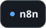
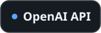
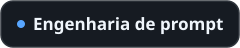
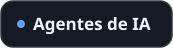
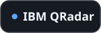
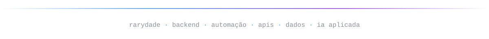

<picture>
  <source media="(prefers-color-scheme: dark)" srcset="assets/images/hero-dark.svg">
  <source media="(prefers-color-scheme: light)" srcset="assets/images/hero-light.svg">
  
</picture>

<br>

**Desenvolvedor backend e de automação.** Conecto sistemas por APIs, automatizo o trabalho manual que fica entre eles e transformo dados inconsistentes em informação confiável — principalmente com Python e Node.js. Uso LLMs onde fazem diferença: extração estruturada, pontuação e agentes dentro de fluxos de automação. Também já automatizei fluxos de segurança no IBM QRadar SOAR, e Cybersecurity é a área em que estou me aprofundando.

<sub>Brasília, Brasil · Estudante de Análise e Desenvolvimento de Sistemas</sub>

## Stack

| | |
|:--|:--|
| **Linguagens** | <picture><source media="(prefers-color-scheme: dark)" srcset="assets/icons/stack-languages-dark.svg"><source media="(prefers-color-scheme: light)" srcset="assets/icons/stack-languages-light.svg"></picture> |
| **Backend e APIs** | <picture><source media="(prefers-color-scheme: dark)" srcset="assets/icons/stack-backend-dark.svg"><source media="(prefers-color-scheme: light)" srcset="assets/icons/stack-backend-light.svg"></picture> |
| **Automação** | <picture><source media="(prefers-color-scheme: dark)" srcset="assets/icons/chip-playwright-dark.svg"><source media="(prefers-color-scheme: light)" srcset="assets/icons/chip-playwright-light.svg"></picture> <picture><source media="(prefers-color-scheme: dark)" srcset="assets/icons/chip-n8n-dark.svg"><source media="(prefers-color-scheme: light)" srcset="assets/icons/chip-n8n-light.svg"></picture> <picture><source media="(prefers-color-scheme: dark)" srcset="assets/icons/chip-power-automate-dark.svg"><source media="(prefers-color-scheme: light)" srcset="assets/icons/chip-power-automate-light.svg"></picture> <picture><source media="(prefers-color-scheme: dark)" srcset="assets/icons/chip-ui-vision-dark.svg"><source media="(prefers-color-scheme: light)" srcset="assets/icons/chip-ui-vision-light.svg"></picture> |
| **Dados** | <picture><source media="(prefers-color-scheme: dark)" srcset="assets/icons/chip-pandas-dark.svg"><source media="(prefers-color-scheme: light)" srcset="assets/icons/chip-pandas-light.svg"></picture> <picture><source media="(prefers-color-scheme: dark)" srcset="assets/icons/chip-power-bi-dark.svg"><source media="(prefers-color-scheme: light)" srcset="assets/icons/chip-power-bi-light.svg"></picture> <picture><source media="(prefers-color-scheme: dark)" srcset="assets/icons/chip-dax-dark.svg"><source media="(prefers-color-scheme: light)" srcset="assets/icons/chip-dax-light.svg"></picture> <picture><source media="(prefers-color-scheme: dark)" srcset="assets/icons/chip-excel-dark.svg"><source media="(prefers-color-scheme: light)" srcset="assets/icons/chip-excel-light.svg"></picture> |
| **IA aplicada** | <picture><source media="(prefers-color-scheme: dark)" srcset="assets/icons/chip-openai-api-dark.svg"><source media="(prefers-color-scheme: light)" srcset="assets/icons/chip-openai-api-light.svg"></picture> <picture><source media="(prefers-color-scheme: dark)" srcset="assets/icons/chip-saida-estruturada-dark.svg"><source media="(prefers-color-scheme: light)" srcset="assets/icons/chip-saida-estruturada-light.svg"></picture> <picture><source media="(prefers-color-scheme: dark)" srcset="assets/icons/chip-engenharia-de-prompt-dark.svg"><source media="(prefers-color-scheme: light)" srcset="assets/icons/chip-engenharia-de-prompt-light.svg"></picture> <picture><source media="(prefers-color-scheme: dark)" srcset="assets/icons/chip-agentes-de-ia-dark.svg"><source media="(prefers-color-scheme: light)" srcset="assets/icons/chip-agentes-de-ia-light.svg"></picture> |
| **Segurança** | <picture><source media="(prefers-color-scheme: dark)" srcset="assets/icons/chip-ibm-qradar-dark.svg"><source media="(prefers-color-scheme: light)" srcset="assets/icons/chip-ibm-qradar-light.svg"></picture> <picture><source media="(prefers-color-scheme: dark)" srcset="assets/icons/chip-qradar-soar-dark.svg"><source media="(prefers-color-scheme: light)" srcset="assets/icons/chip-qradar-soar-light.svg"></picture> <picture><source media="(prefers-color-scheme: dark)" srcset="assets/icons/chip-playbooks-e-regras-dark.svg"><source media="(prefers-color-scheme: light)" srcset="assets/icons/chip-playbooks-e-regras-light.svg"></picture> |
| **Frontend** | <picture><source media="(prefers-color-scheme: dark)" srcset="assets/icons/stack-frontend-dark.svg"><source media="(prefers-color-scheme: light)" srcset="assets/icons/stack-frontend-light.svg"></picture> |
| **Ferramentas** | <picture><source media="(prefers-color-scheme: dark)" srcset="assets/icons/stack-tools-dark.svg"><source media="(prefers-color-scheme: light)" srcset="assets/icons/stack-tools-light.svg"></picture> |

<details>
<summary><b>Como eu uso</b></summary>
<br>

- **Python** — scripts de automação, extração e tratamento de dados, clientes de API, automações de segurança em playbooks SOAR e o núcleo do meu pipeline de vagas.
- **Node.js · TypeScript** — backends web e agregação de APIs; route handlers no Next.js que mantêm as chaves de API no servidor.
- **PHP · Laravel** — APIs REST com validação de requisições, resources, migrations e testes.
- **Playwright · n8n** — automação de navegador para sites renderizados em JavaScript; orquestração de pipelines agendados.
- **Power Automate · UI Vision** — RPA de processos de negócio, mapeados antes, com tratamento de exceções e notificações.
- **pandas · Power BI · DAX · Excel** — limpeza e padronização de dados, modelagem de relacionamentos, indicadores e dashboards.
- **OpenAI API** — saída estruturada para extração e pontuação, engenharia de prompt e de contexto, agentes de IA dentro de automações.
- **IBM QRadar · QRadar SOAR** — automações em Python, regras e nós de playbook, validados com testes iterativos.
- **Postman** — validação de contratos de API e depuração de erros HTTP antes de mexer no código.

</details>

## Projetos em destaque

<sub>✅ Concluído · 🧪 Protótipo · 🚧 Em desenvolvimento · 📐 Planejamento</sub>

### 🧪 Image Search Hub
Busca em vários bancos de imagens ao mesmo tempo, mesmo com cada API usando nomes diferentes e falhando de forma independente.

`Next.js 14` `TypeScript` `React` `Tailwind CSS` `Vitest` `Unsplash API` `Pexels API`

```
cliente → route handler (chaves só no servidor) → registry de provedores
        → [adapter Unsplash, adapter Pexels] via Promise.allSettled
        → normaliza para ImageResult → deduplica → cache curto → cliente
```

- Um adapter por provedor traduz as diferenças (`squarish` × `square`, limite de 30 × 80 por página) para um modelo único.
- `Promise.allSettled` mantém os resultados chegando quando um provedor cai.
- Novo provedor = implementar uma interface, sem condicionais espalhadas.
- Testes com Vitest para normalização dos adapters, validação da busca e falha parcial de provedor.

<sub>Status: estrutura e testes escritos; validação local pendente. Repositório ainda não publicado.</sub>

### 🚧 Bot de Vagas por Currículo
Lê o currículo uma vez, coleta vagas todos os dias e envia no Telegram só as que dão match — cada uma com o motivo.

`Python` `n8n` `Playwright` `httpx` `OpenAI API (saída estruturada)` `PostgreSQL / Supabase` `Telegram Bot API`

```
currículo PDF → parser → perfil estruturado ─┐
cron → coletores (Playwright / httpx) → normaliza → deduplica
     → score + justificativa via LLM → PostgreSQL → acima do limiar? → Telegram
```

<sub>Status: em desenvolvimento — parser de currículo em andamento. Repositório ainda não publicado.</sub>

### ✅ Integração com a Pluggy API
Desafio de integração com o sandbox de uma API de dados financeiros: autenticação, items, accounts e transactions. A maior parte do trabalho foi depurar respostas `400` e `401` lendo o contrato da API, não no chute.

`REST` `JSON` `Postman`

### 📐 Content Intelligence Studio
Um ciclo orientado a dados para conteúdo no YouTube: coletar → analisar desempenho → encontrar padrões → testar hipóteses → produzir → medir de novo. Primeiro módulo: um **YouTube Data Collector** que grava snapshots diários idempotentes, já que a API só devolve os valores atuais.

Stack planejada: `Python` `YouTube Data API v3` `PostgreSQL` `BigQuery` `Cloud Run` `Cloud Scheduler`

<sub>Status: arquitetura e modelo de dados em definição.</sub>

## Repositórios públicos

| Repositório | O que mostra | Stack |
|:--|:--|:--|
| [books-api](https://github.com/RaryssonDEV/books-api) | API REST com rotas versionadas, Form Requests, API Resources e testes de feature | Laravel · MySQL |
| [API-BOOK](https://github.com/RaryssonDEV/API-BOOK) | A mesma API sem framework: camadas Repository → Service → Validator | PHP · MySQL |
| [Najason-Test](https://github.com/RaryssonDEV/Najason-Test) | CSV → API do IBGE → correção de municípios com erro de digitação → CSV corrigido | Python · pandas · RapidFuzz |
| [mini-gerador-fht](https://github.com/RaryssonDEV/mini-gerador-fht) | Endpoint JSON no módulo `http` nativo do Node, sem dependências, com validação e testes | Node.js |

## Decisões de engenharia

- **Adapters absorvem as diferenças entre APIs** — nomes e limites ficam fora da lógica compartilhada.
- **Degradar em vez de falhar** — chamadas paralelas com `Promise.allSettled`.
- **Segredos isolados pela arquitetura** — módulos `server-only`, não disciplina.
- **Termos de uso de API são requisito** — o registro de download da Unsplash tem rota própria no servidor.
- **Normalizar antes de deduplicar** — e deduplicar antes de pontuar ou gravar.
- **Automação começa pelo processo** — mapear o fluxo, tratar exceções, notificar.
- **Depurar HTTP pelo status code** — validar o contrato antes de culpar o código.

## Estudando agora

- **Concorrência em Python** — `asyncio`, `TaskGroup`, semáforos
- **Fundamentos de Google Cloud** — Cloud Run, Cloud Scheduler, BigQuery, IAM
- **SQL avançado** — CTEs, window functions, `EXPLAIN` (próximo da fila)
- **Cybersecurity** — trilha estruturada a partir da experiência prática com automação no SOAR

<sub>No radar: FastAPI · Docker · CI/CD · filas com Redis · pgvector / RAG</sub>

## Atividade

<picture>
  <source media="(prefers-color-scheme: dark)" srcset="assets/generated/top-langs-dark.svg">
  <source media="(prefers-color-scheme: light)" srcset="assets/generated/top-langs-light.svg">
  
</picture>
<!--
  Ativar quando houver mais atividade pública (o workflow já gera estes arquivos):
<picture>
  <source media="(prefers-color-scheme: dark)" srcset="assets/generated/stats-dark.svg">
  <source media="(prefers-color-scheme: light)" srcset="assets/generated/stats-light.svg">
  
</picture>
<picture>
  <source media="(prefers-color-scheme: dark)" srcset="assets/generated/streak-dark.svg">
  <source media="(prefers-color-scheme: light)" srcset="assets/generated/streak-light.svg">
  
</picture>
-->

<picture>
  <source media="(prefers-color-scheme: dark)" srcset="assets/generated/snake-dark.svg">
  <source media="(prefers-color-scheme: light)" srcset="assets/generated/snake-light.svg">
  
</picture>

<sub>O card de linguagens considera só o código dos repositórios públicos (sem HTML/CSS) — a maior parte do meu trabalho fica em ambientes privados ou corporativos. As imagens são regeneradas diariamente por uma <a href=".github/workflows/profile-assets.yml">GitHub Action</a>.</sub>

## Contato

[](https://www.linkedin.com/in/rarysson-ferreira/) [](mailto:raryssondev@gmail.com) [](https://github.com/RaryssonDEV)

<br>

<picture>
  <source media="(prefers-color-scheme: dark)" srcset="assets/images/footer-dark.svg">
  <source media="(prefers-color-scheme: light)" srcset="assets/images/footer-light.svg">
  
</picture>
